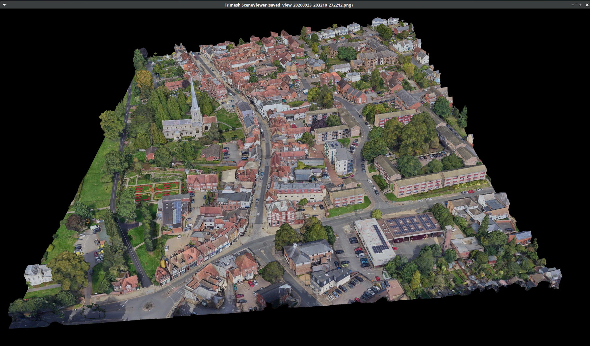

# mini_hemel


```
xhost +local:docker
docker run -it --name god -v /home/jason/work:/workspace  -e DISPLAY=$DISPLAY \
  -v /tmp/.X11-unix:/tmp/.X11-unix:rw \
  --device /dev/dri  ubuntu:24.04


apt-get update
apt-get install -y libgl1 libglu1-mesa libx11-6 libxext6 libxrender1 mesa-utils


```

